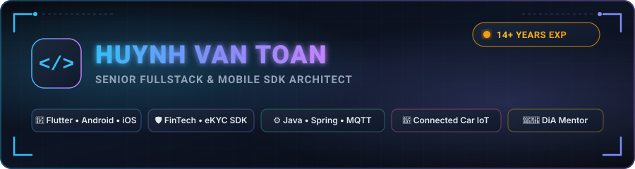

  <!-- Header Banner (Native Vector SVG) -->
  

    

  <!-- Animated Typing Text -->
  

  

    
    
    
    
  

---

### 👨‍💻 About Me

<table>
  <tr>
    <td width="50%" valign="top">
      <h3>📱 Mobile & SDK Architecture</h3>
      
<b>14+ Years</b> building production mobile applications & multi-module SDKs across <b>Flutter, Android (Kotlin), iOS (Swift), and React Native / KMP</b> with Clean Architecture and rock-solid modular isolation.

    </td>
    <td width="50%" valign="top">
      <h3>🛡️ FinTech & Biometric Security</h3>
      
Principal Architect for <b>FinOS eKYC SDK</b> — providing enterprise banking-grade biometric face verification, OCR data extraction, document liveness, and cryptographic tamper protection.

    </td>
  </tr>
  <tr>
    <td width="50%" valign="top">
      <h3>⚙️ Distributed Backend & Scalability</h3>
      
Designing high-throughput microservices powered by <b>Java & Spring Boot</b>, distributed <b>PostgreSQL/Redis</b> caching, and ultra-low latency <b>MQTT / WebSocket</b> real-time messaging brokers.

    </td>
    <td width="50%" valign="top">
      <h3>🚗 Connected Car & Smart IoT</h3>
      
System-level engineering for intelligent electric vehicles (<b>Geely EX2</b>): Vehicle HAL (VHAL), CarPropertyManager telemetry, and TCP/BLE remote companion control systems.

    </td>
  </tr>
</table>

 

> 👨‍🏫 **Trainer & Mentor:** Instructing and mentoring next-generation software engineers in **Modern Android Architecture & Flutter** at **DiA – Học viện Digital**.  
> 💡 **Core Philosophy:** *"Clean architecture isn’t about frameworks — it’s about discipline."*

---

### 🛠️ Tech Stack & Toolbelt

  

 

| Domain | Technologies & Frameworks |
| :--- | :--- |
| **📱 Mobile & SDKs** | **Flutter**, **Android (Kotlin / Java)**, **iOS (Swift / Objective-C)**, **React Native**, **Kotlin Multiplatform (KMP)**, Jetpack Compose, Coroutines/Flow, Clean Architecture |
| **⚙️ Backend & APIs** | **Java**, **Spring Boot**, **Microservices**, **PostgreSQL**, **MySQL**, **Redis**, **MQTT (HiveMQ/EMQX)**, **WebSocket**, RESTful APIs, Swagger/OpenAPI |
| **🚀 DevOps & Cloud** | **Docker**, **Git / GitHub Actions**, Linux, Maven, Gradle, CI/CD Automation, MCP (Model Context Protocol) |
| **🛡️ Specialized Domains** | **FinTech & eKYC Security**, Multi-Module SDK Packaging, Automotive VHAL & Embedded Android, Real-Time Chat & VoIP Systems |

---

### 📦 Featured Repositories & SDKs

<table>
  <tr>
    <td width="50%" valign="top">
      <h4>📱 <a href="https://github.com/ToanMobile/BaseCoreFlutter">BaseCoreFlutter</a></h4>
      
Production-ready Flutter starter kit featuring Clean Architecture, Bloc/Cubit state management, auto-routing, and comprehensive network/storage handlers.

      

        
        
      

    </td>
    <td width="50%" valign="top">
      <h4>🤖 <a href="https://github.com/ToanMobile/BaseCoreKotlin">BaseCoreKotlin</a></h4>
      
Modern Android base architecture implementing MVVM/MVI, Kotlin Coroutines, Flow, Jetpack components, and multi-module project structure.

      

        
        
      

    </td>
  </tr>
  <tr>
    <td width="50%" valign="top">
      <h4>⚡ <a href="https://github.com/ToanMobile/SpringBootTemplate">SpringBootTemplate</a></h4>
      
Enterprise-grade Spring Boot backend template equipped with JWT authentication, Redis caching, PostgreSQL integration, and Swagger API docs.

      

        
        
        
      

    </td>
    <td width="50%" valign="top">
      <h4>💬 <a href="https://github.com/ToanMobile/NetAloSDKAndroid">NetAloSDK Suite</a></h4>
      
High-performance Real-Time Messaging & Calling SDK ecosystem cross-compiled for <b>Android</b>, <b>Flutter</b>, and <b>React Native</b> via WebSockets/WebRTC.

      

        
        
      

    </td>
  </tr>
  <tr>
    <td width="50%" valign="top">
      <h4>🚗 <a href="https://github.com/ToanMobile/GeelyEx2">Geely EX2 Connected Car</a></h4>
      
Smart automotive system app (VHAL + CarPropertyManager + Flyme Auto) & TCP/BLE remote companion phone controller for electric vehicles.

      

        
        
      

    </td>
    <td width="50%" valign="top">
      <h4>🔌 <a href="https://github.com/ToanMobile/play-store-mcp">Play Store MCP Server</a></h4>
      
Model Context Protocol (MCP) server integration bridge for managing, querying, and automating Google Play Developer Console APIs with AI.

      

        
        
      

    </td>
  </tr>
</table>

---

### 📊 GitHub Activity & Analytics

  <table border="0">
    <tr>
      <td>
        
      </td>
      <td>
        
      </td>
    </tr>
    <tr>
      <td>
        
      </td>
      <td>
        
      </td>
    </tr>
  </table>

   

  

---

### 🤝 Get in Touch

  **Let's build something extraordinary together!**  
  *Whether you want to discuss a new SDK architecture, high-concurrency backend, FinTech security, or mobile engineering training.*

   

  
  &nbsp;
  
  &nbsp;
  

    

  

